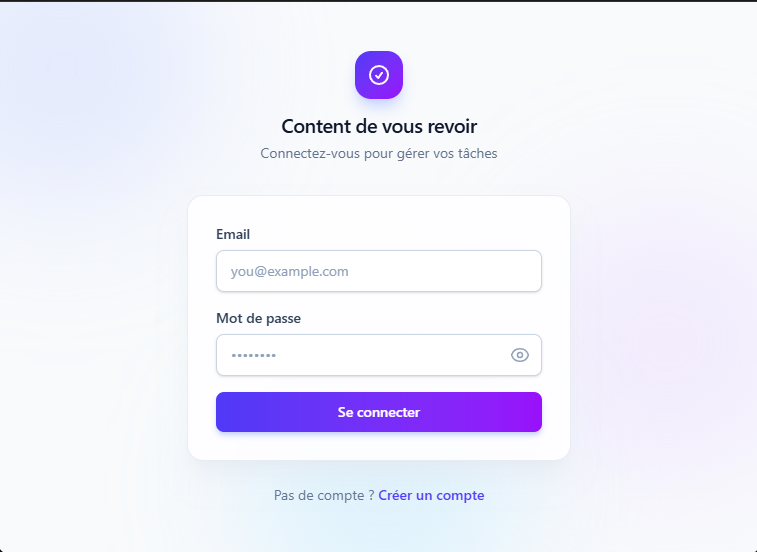
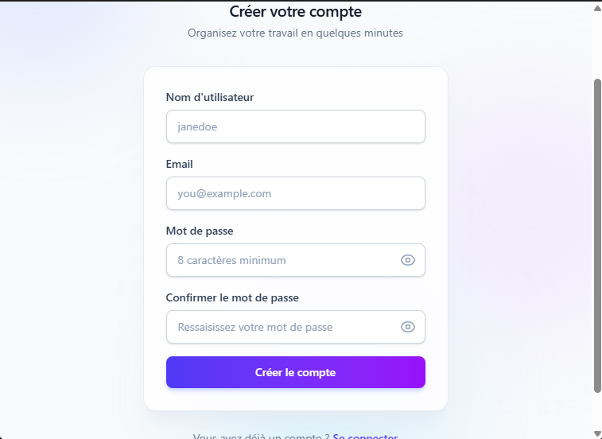
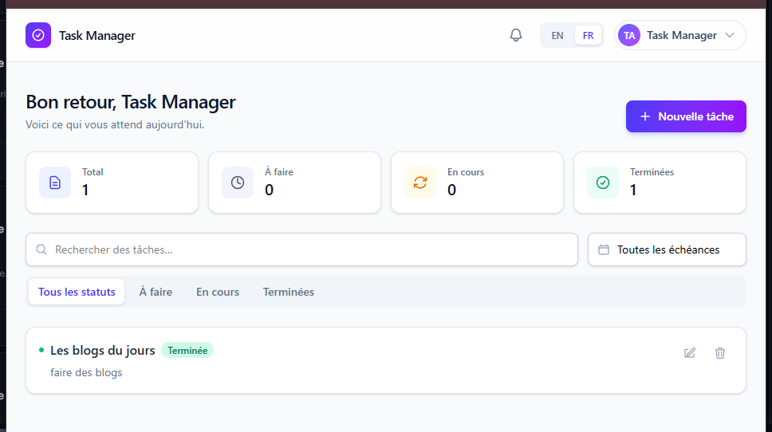
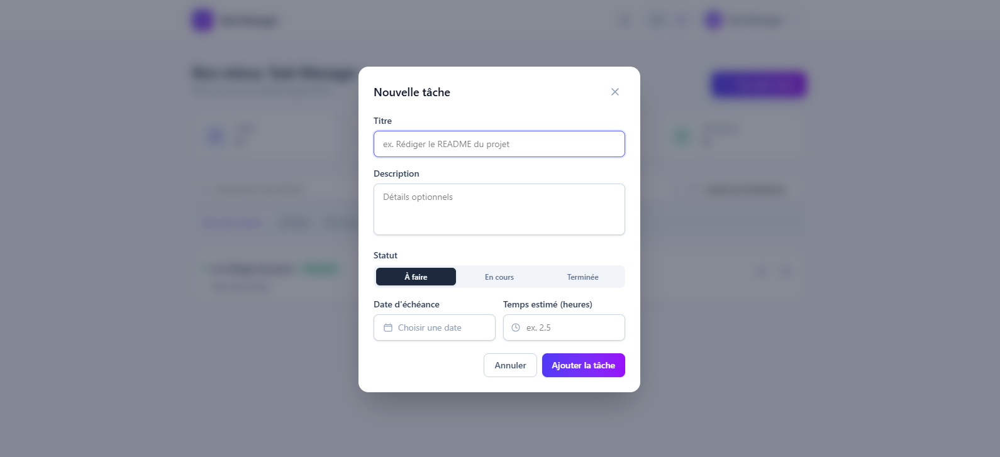

# Task Manager Enterprise

Application complète de gestion de tâches : API REST sécurisée par JWT (Spring Boot) et interface web moderne (React + Vite + TypeScript).

## Sommaire

- [Architecture](#architecture)
- [Stack technique](#stack-technique)
- [Démarrage rapide (Docker Compose)](#démarrage-rapide-docker-compose)
- [Démarrage en local (sans Docker)](#démarrage-en-local-sans-docker)
- [Documentation de l'API](#documentation-de-lapi)
- [Sécurité](#sécurité)
- [Variables d'environnement](#variables-denvironnement)
- [Tests](#tests)
- [CI/CD](#cicd)
- [Structure du projet](#structure-du-projet)
- [Application mobile (Flutter)](#application-mobile-flutter)
- [Captures d'écran](#captures-décran)

## Architecture

```
task-manager-enterprise/
├── backend/    API REST Spring Boot (Java 21)
├── frontend/   Application React + Vite + TypeScript
└── docker-compose.yml
```

**Backend** — architecture en couches, sans logique métier dans les controllers :

```
controller  → endpoints HTTP, validation des requêtes
service     → logique métier
repository  → accès aux données (Spring Data JPA)
entity      → modèle de persistance
dto         → contrats d'entrée/sortie de l'API (jamais l'entité exposée directement)
mapper      → conversion entity <-> DTO
security    → JWT, filtre d'authentification, configuration Spring Security
exception   → gestion centralisée des erreurs (@RestControllerAdvice)
config      → configuration OpenAPI/Swagger
```

**Choix techniques principaux :**
- **JWT stateless** (Spring Security 6, filtre `OncePerRequestFilter`) : pas de session serveur, adapté à un client web/mobile.
- **DTO systématiques** : le mot de passe (même hashé) ou les détails internes de l'entité `User` ne sont jamais exposés en JSON.
- **`@RestControllerAdvice` global** : toutes les erreurs (404, 400 de validation, 401, 409, 500) renvoient un format JSON cohérent (`timestamp`, `status`, `error`, `message`, `path`).
- **Profil de test dédié (H2 en mémoire)** : les tests d'intégration tournent sans dépendance externe, MySQL n'est utilisé qu'en dev/production.
- **Isolation des données par utilisateur** : chaque requête sur `/api/tasks` est filtrée par l'utilisateur authentifié (`findByIdAndUserId`), empêchant l'accès aux tâches d'un autre compte.

**Frontend** — organisation par responsabilité :

```
api        → client Axios + appels HTTP typés vers le backend
context    → AuthContext (session, token JWT persistés en localStorage)
i18n       → LanguageContext + dictionnaire EN/FR (langue détectée du navigateur, persistée)
components → briques UI réutilisables (formulaire, liste, carte de tâche, modales animées, garde de route)
pages      → écrans (connexion, inscription, tableau de bord des tâches, paramètres du compte)
types      → types TypeScript partagés (Task, AuthUser, UserProfile, ...)
```

**Fonctionnalités notables :**
- **Tableau de bord** : cartes de statistiques, recherche, filtres par statut et par échéance (en retard / aujourd'hui / 7 prochains jours / sans échéance), création et édition de tâches dans des modales animées, suppression avec confirmation.
- **Échéances** : chaque tâche peut avoir une date d'échéance optionnelle, avec badge "en retard" sur les tâches dépassées.
- **Bilingue (EN/FR)** : sélecteur de langue dans l'en-tête et dans les paramètres.
- **Paramètres du compte** : modification du profil (username/email) et changement de mot de passe.

## Stack technique

| Domaine       | Technologies |
|---------------|--------------|
| Backend       | Java 21, Spring Boot 4.1, Spring Data JPA, Spring Security 6, JWT (jjwt), MySQL 8, Maven |
| Frontend      | React 18, Vite, TypeScript, Tailwind CSS 4, Axios, React Router, Framer Motion, react-hot-toast |
| Tests         | JUnit 5, Mockito, AssertJ, Spring MockMvc, base H2 en mémoire |
| Documentation | springdoc-openapi (Swagger UI) |
| DevOps        | Docker (multi-stage), Docker Compose, GitHub Actions |

> **Note technique :** au moment de la réalisation de ce test, Spring Initializr ne propose plus Spring Boot 3.x (plage de compatibilité `>=4.0.0`). Le projet utilise donc Spring Boot 4.1, dont le modèle de programmation (Spring Web MVC, Spring Data JPA, Spring Security par filtre) est directement équivalent à celui de Spring Boot 3.x demandé dans l'énoncé.

## Configuration (.env)

Toutes les valeurs sensibles (identifiants base de données, secret JWT, ports) sont lues depuis des variables d'environnement — aucune n'est codée en dur dans le dépôt. Chaque `.env` réel est ignoré par Git ; seuls les `.env.example` sont versionnés.

| Fichier                     | Utilisé par                          |
|------------------------------|---------------------------------------|
| `.env` (racine)              | `docker compose up`                   |
| `backend/.env`               | `./mvnw spring-boot:run` (via [spring-dotenv](https://github.com/paulschwarz/spring-dotenv)) |
| `frontend/.env`              | `npm run dev` / `npm run build` (Vite)|

```bash
cp .env.example .env
cp backend/.env.example backend/.env
cp frontend/.env.example frontend/.env
```

## Démarrage rapide (Docker Compose)

Prérequis : Docker et Docker Compose.

```bash
git clone https://github.com/DavidDef04/task-manager-enterprise.git
cd task-manager-enterprise
cp .env.example .env
docker compose up --build
```

- Frontend : http://localhost:5173
- API : http://localhost:8081/api
- Documentation Swagger : http://localhost:8081/swagger-ui.html
- MySQL exposé sur le port 3307 sur la machine hôte (utilisateur/mot de passe définis dans `.env`)

## Démarrage en local (sans Docker)

### Backend

Prérequis : JDK 21, MySQL 8 (ou modifier `backend/.env` pour pointer vers votre instance).

```bash
cd backend
cp .env.example .env
./mvnw spring-boot:run
```

L'API démarre sur le port défini par `SERVER_PORT` (8081 par défaut). Toutes les autres valeurs (`DB_HOST`, `DB_PORT`, `DB_NAME`, `DB_USERNAME`, `DB_PASSWORD`, `JWT_SECRET`, `JWT_EXPIRATION_MS`) viennent de `backend/.env`.

### Frontend

Prérequis : Node.js 22+.

```bash
cd frontend
cp .env.example .env   # ajuster VITE_API_URL si besoin
npm install
npm run dev
```

L'application démarre sur `http://localhost:5173` et consomme l'API définie par `VITE_API_URL`.

## Documentation de l'API

Une fois le backend démarré, la documentation interactive Swagger est disponible sur `/swagger-ui.html`.

| Méthode | Endpoint              | Description                              | Authentification |
|---------|------------------------|-------------------------------------------|-------------------|
| POST    | `/api/auth/register`  | Inscription d'un utilisateur              | Non               |
| POST    | `/api/auth/login`     | Connexion, retourne un token JWT          | Non               |
| GET     | `/api/tasks`          | Liste des tâches de l'utilisateur connecté (`status`, `search` en query params optionnels) | Oui |
| POST    | `/api/tasks`          | Création d'une tâche                      | Oui               |
| PUT     | `/api/tasks/{id}`     | Modification d'une tâche                  | Oui               |
| DELETE  | `/api/tasks/{id}`     | Suppression d'une tâche                   | Oui               |
| GET     | `/api/users/me`       | Profil de l'utilisateur connecté          | Oui               |
| PUT     | `/api/users/me`       | Mise à jour du username/email             | Oui               |
| PUT     | `/api/users/me/password` | Changement de mot de passe             | Oui               |

Les routes protégées attendent l'en-tête `Authorization: Bearer <token>`.

## Sécurité

Conçu avec une hypothèse d'usage sensible (le sujet mentionne des systèmes financiers) :

- **Mots de passe** : politique de complexité réelle (10 caractères min., majuscule, minuscule, chiffre, caractère spécial) via un validateur Bean Validation dédié (`@StrongPassword`), plus une liste de mots de passe courants rejetés même s'ils satisfont la complexité (ex. `Password123!`). Hashés avec BCrypt, jamais stockés ni renvoyés en clair. Le changement de mot de passe exige l'ancien mot de passe et refuse de le réutiliser.
- **Anti brute-force** : `/api/auth/login` et `/api/auth/register` sont limités à 10 tentatives / 15 min par IP (filtre en mémoire, retourne `429`), désactivé uniquement dans le profil de test.
- **JWT** : signé HMAC, sans secret par défaut codé en dur — l'application refuse de démarrer si `JWT_SECRET` n'est pas fourni, plutôt que de tourner silencieusement avec un secret public.
- **CORS** : liste blanche explicite d'origines (`CORS_ALLOWED_ORIGINS`), pas de wildcard, `allowCredentials` désactivé (l'API n'utilise pas de cookies).
- **Isolation des données** : chaque requête sur `/api/tasks` est filtrée par l'utilisateur authentifié ; aucun accès aux tâches d'un autre compte, y compris par ID deviné.
- **Pas de secret dans le dépôt** : toute la configuration sensible vient de fichiers `.env` non commités (voir section suivante).
- **En-têtes de sécurité** : les protections par défaut de Spring Security s'appliquent (`X-Content-Type-Options`, `X-Frame-Options`, session stateless).

Compromis connus, assumés pour ce périmètre de test : le token JWT est stocké côté client dans `localStorage` (pattern standard pour une SPA sans backend-for-frontend, mais sensible au vol par XSS si une faille d'injection existait — React échappe le rendu par défaut et le code n'utilise `dangerouslySetInnerHTML` nulle part) ; l'inscription révèle si un email est déjà utilisé (compromis UX courant) ; et TLS n'est pas géré par l'application elle-même (à terminer au niveau du reverse proxy/hébergeur en production).

## Variables d'environnement

### Backend

| Variable            | Défaut (dev)                                              | Description |
|---------------------|-------------------------------------------------------------|--------------|
| `DB_HOST`           | `localhost`                                                 | Hôte MySQL |
| `DB_PORT`           | `3306`                                                       | Port MySQL |
| `DB_NAME`           | `taskmanager`                                                | Nom de la base |
| `DB_USERNAME`       | `taskmanager`                                                | Utilisateur MySQL |
| `DB_PASSWORD`       | `taskmanager`                                                | Mot de passe MySQL |
| `JWT_SECRET`        | **aucun — obligatoire**                                      | Clé de signature JWT ; l'app refuse de démarrer si absente |
| `JWT_EXPIRATION_MS` | `86400000` (24h)                                             | Durée de validité du token |
| `CORS_ALLOWED_ORIGINS` | `http://localhost:5173`                                   | Origines autorisées (liste séparée par des virgules) |

### Frontend

| Variable        | Défaut                          | Description |
|------------------|----------------------------------|--------------|
| `VITE_API_URL`  | `http://localhost:8081/api`      | URL de base de l'API consommée par le frontend |

## Tests

### Backend

```bash
cd backend
./mvnw test
```

Couverture : tests unitaires des services (`AuthService`, `TaskService` avec Mockito) et tests d'intégration des controllers (`MockMvc` + base H2), incluant des cas limites : email/username déjà utilisés, identifiants invalides, tâche inexistante ou appartenant à un autre utilisateur, champs de validation manquants.

### Frontend

```bash
cd frontend
npm run lint
npm run build
```

## CI/CD

Le pipeline GitHub Actions (`.github/workflows/ci.yml`) s'exécute à chaque push/PR sur `main` :
1. **backend** : compilation et tests Maven.
2. **frontend** : lint et build Vite.
3. **docker** : build des images Docker backend et frontend (validation, sans push) une fois les deux jobs précédents réussis.

## Structure du projet

```
task-manager-enterprise/
├── backend/
│   ├── src/main/java/com/taskmanager/backend/
│   │   ├── controller/
│   │   ├── service/
│   │   ├── repository/
│   │   ├── entity/
│   │   ├── dto/
│   │   ├── mapper/
│   │   ├── security/
│   │   ├── exception/
│   │   └── config/
│   ├── src/test/java/...
│   └── Dockerfile
├── frontend/
│   ├── src/
│   │   ├── api/
│   │   ├── context/
│   │   ├── components/
│   │   ├── pages/
│   │   └── types/
│   └── Dockerfile
├── mobile/
│   └── lib/
│       ├── models/
│       ├── services/
│       ├── screens/
│       ├── widgets/
│       └── theme/
├── docker-compose.yml
└── .github/workflows/ci.yml
```

## Application mobile (Flutter)

En bonus du test, un client mobile Flutter (Android) est fourni dans [`mobile/`](mobile), avec l'authentification JWT et le CRUD complet des tâches, connecté à la même API backend que le frontend web. Voir [`mobile/README.md`](mobile/README.md) pour l'installation, la configuration de l'URL du backend et la génération de l'APK.

📱 **APK prêt à installer** : [télécharger la dernière release](https://github.com/DavidDef04/task-manager-enterprise/releases/tag/v1.0.0-mobile) (pas besoin de compiler le projet).

## Captures d'écran

| Connexion | Inscription |
|---|---|
|  |  |

| Tableau de bord | Création de tâche (calendrier) |
|---|---|
|  |  |


