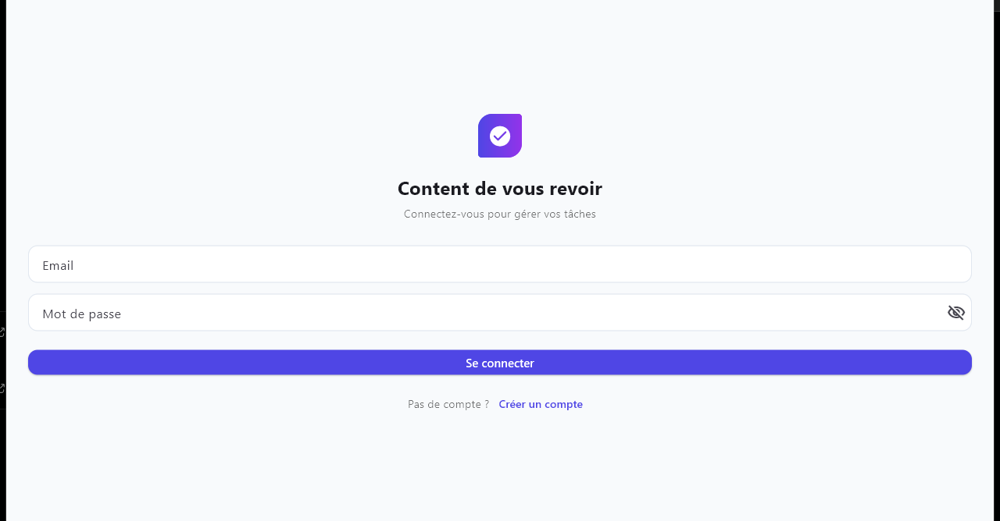
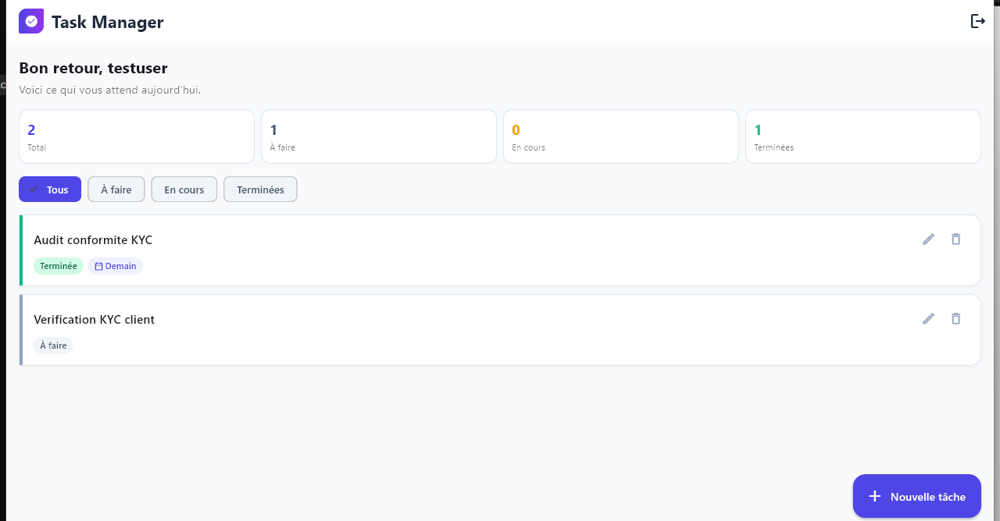
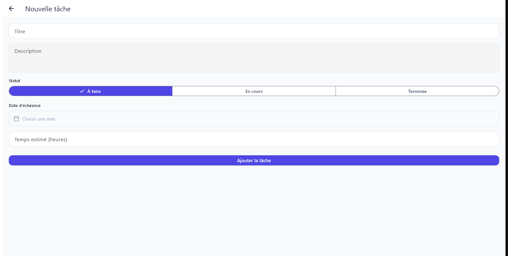

# Task Manager — Mobile (Flutter)

A Flutter client for the Task Manager Enterprise backend: register/login (JWT), and full CRUD on tasks (title, description, status, due date, estimated hours), with the same visual language as the web app.

📱 **Pre-built APK**: download the latest release [here](https://github.com/DavidDef04/task-manager-enterprise/releases/tag/v1.0.0-mobile) — no need to build from source.

## Stack

- Flutter 3.47 / Dart 3.13
- `provider` for state management (`AuthService` as a `ChangeNotifier`)
- `http` for the REST client, `shared_preferences` to persist the JWT on-device
- No code generation, no backend-specific SDK — plain `http` calls against the same Spring Boot API used by the web frontend

## Project structure

```
lib/
  models/       Task, TaskInput, AuthUser — mirror the backend DTOs
  services/     ApiClient (HTTP + JWT), AuthService, TaskService
  screens/      LoginScreen, RegisterScreen, TasksScreen, TaskFormScreen
  widgets/      TaskCard, BrandMark
  theme/        Colors and ThemeData matching the web app's indigo/purple branding
```

## Pointing the app at your backend

The backend has no publicly reachable URL — you run it locally. Android does **not** treat your computer's `localhost` as the phone/emulator's `localhost`, so the base URL must be set explicitly in [`lib/services/api_client.dart`](lib/services/api_client.dart):

```dart
const String apiBaseUrl = 'http://192.168.1.144:8081/api';
```

- **Physical device** (recommended — connect your phone to the same Wi-Fi as your computer): use your computer's LAN IP, e.g. `http://192.168.1.144:8081/api` (find it with `ipconfig` on Windows or `ifconfig`/`ip addr` on macOS/Linux). This is what the app ships with by default.
- **Android emulator**: use `http://10.0.2.2:8081/api` — the emulator's special alias for the host machine.

The backend must be running (`docker compose up -d` from the repo root) and reachable on that address/port before you log in.

## Running in development

```bash
flutter pub get
flutter run
```

## Building the APK

```bash
flutter build apk --release
```

The signed-with-debug-keys release APK is produced at:

```
build/app/outputs/flutter-apk/app-release.apk
```

Install it on a device with `adb install build/app/outputs/flutter-apk/app-release.apk`, or transfer the file and install it directly (you'll need to allow "install from unknown sources" once, since it isn't signed with a Play Store key).

## Screenshots

| Login | Task list | New task |
|---|---|---|
|  |  |  |

## Known trade-offs (test/demo scope)

- **Cleartext HTTP is allowed** (`android:usesCleartextTraffic="true"`) because the backend runs on plain HTTP for local testing. In a real deployment the backend would be served over HTTPS and this flag removed.
- **The release APK is signed with the Flutter debug keystore** (Flutter's default for `flutter build apk --release` when no signing config is set), which is fine for evaluation but not for a Play Store submission.
- **No offline cache** — the task list is fetched fresh on load and on pull-to-refresh; there's no local persistence beyond the JWT.
- The UI is French-only (matching the primary language used across this project); the web app has full EN/FR i18n, which wasn't duplicated here given the mobile app is a bonus deliverable.
